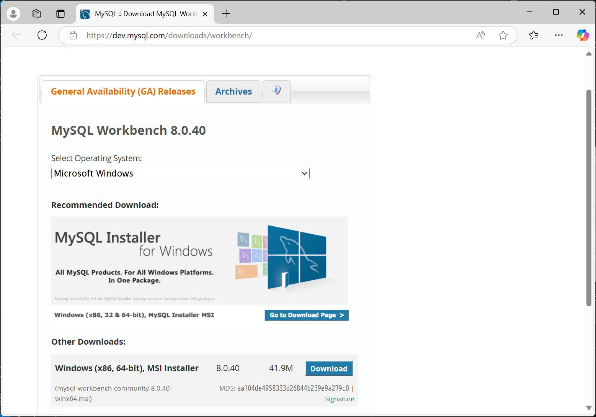
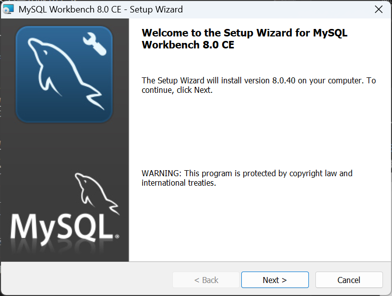
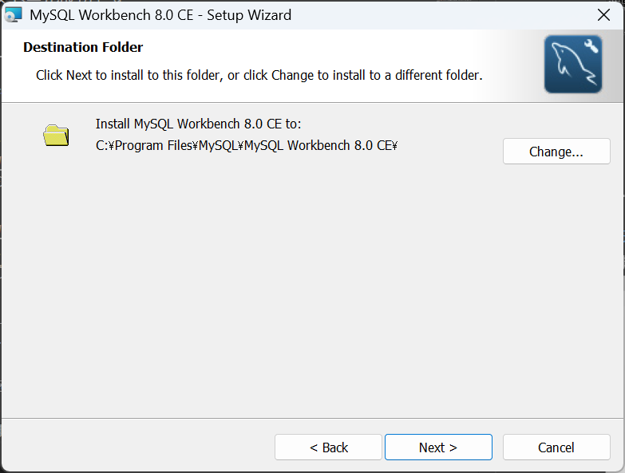
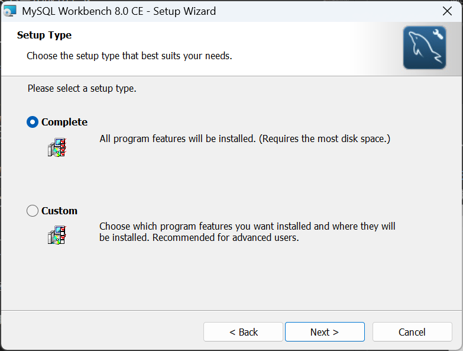
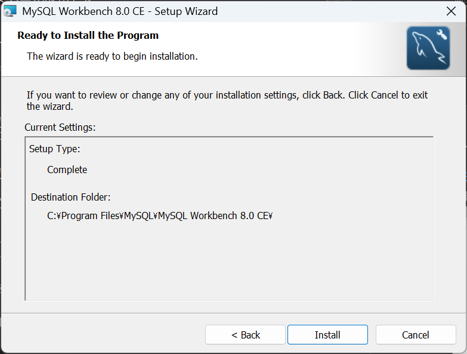

# Installing MySQL Workbench

1. [こちら](https://dev.mysql.com/downloads/workbench/)からMySQL Workbenchのダウンロードページにアクセスします。

2. **Windows (x86, 64-bit), MSI Installer**をダウンロードします。
3. No thanks, just start my download.をクリックします。
4. ダウンロードした「mysql-workbench-community-8.0.40-winx64.msi」を実行します。
5. インストーラが起動したら、**Next**をクリックします。

6. **Next**をクリックします。

7. **Complete**を選択し、**Next**をクリックします。

8. **Install**をクリックします。

9. インストールが完了したら、**Finish**をクリックします。

以上でMySQL Workbenchのインストールが完了しました。

1. MySQL Workbenchを起動します。
2. **My SQL Connections**の右側にある**+**をクリックします。
3. **Connection Name**に接続名を「Local instance」に設定します。
4. **Password**のStore in Vaultをクリックし、パスワードを入力します。