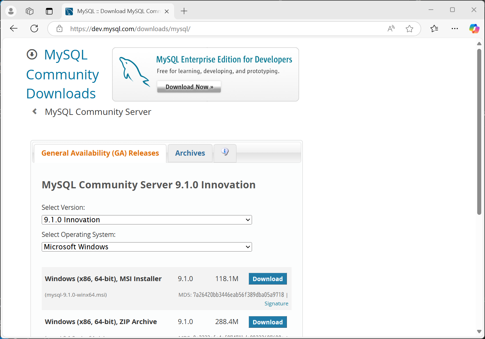

# MySQLの環境構築

## Installing MySQL Server on Windows

1. [こちら](https://dev.mysql.com/downloads/mysql/)からMySQLのダウンロードページにアクセスします。

2. **Windows (x86, 64-bit), MSI Installer**をダウンロードします。
3. No thanks, just start my download.をクリックします。
4. ダウンロードした「mysql-9.1.0-winx64.msi」を実行します。
   1. 「This application requires Visual Studio 2019 x64 Redistributable. 
   Please install the Redistributable then run this installer again.」と表示された場合、
   [こちら](https://learn.microsoft.com/ja-jp/cpp/windows/latest-supported-vc-redist?view=msvc-170)から
   「最新の Microsoft Visual C++ 再頒布可能パッケージ バージョン X64」をダウンロードし、インストールします。
5. インストーラが起動したら、**Next**をクリックします。

6. **I accept the terms in the License Agreement**にチェックを入れ、**Next**をクリックします。

7. **Typical**を選択し、**Next**をクリックします。

8. **Install**をクリックします。

9. インストールが完了したら、**Finish**をクリックします。


## MySQL Configuratorの設定

1. MySQL Community Serverのインストールが完了したら、MySQL Configuratorが起動します。

2. **Next**をクリックします。

3. **Next**をクリックします。

4. **MySQL Root Password**にパスワードを入力し、**Next**をクリックします。入力したパスワードを忘れないようにしてください。昨日はThe Lion Kingを見ましたので、パスワードは「hakunamatata」にしました。

5. **Next**をクリックします。

6. **Next**をクリックします。

7. 必要に応じて、Sample databasesを選択し、**Next**をクリックします。

8. **Execute**をクリックします。

9. 実行が完了したら、**Next**をクリックします。

10. **Finish**をクリックします。


以上でMySQL Community Serverのインストールが完了しました。

## 動作確認

インストールが完了したら、MySQL Command Line Clientを起動して、インストールが成功しているか確認します。

1. スタートメニューからMySQL 9.1 Command Line Clientを起動します。

2. Passwordを入力し、以下のように表示されたらインストール成功です。


<!-- ## Mac

### Macに利用されているCPUアーキテクチャを確認する

1. Spotlightを開く（`Command + Space`を押す）
2. "ターミナル"と入力してEnterを押す
3. ターミナルで次のコマンドを実行する:

```bash
uname -m
```

- `arm64`が表示された場合、ARMアーキテクチャを利用しています。
- `x86_64`が表示された場合、Intelアーキテクチャを利用しています。

### MySQL Community Serverのインストール

1. [こちら](https://dev.mysql.com/downloads/)のページからMySQL Community Serverにアクセスします。
2. CPUアーキテクチャに合わせてDMGファイルをダウンロードします。
3. "No thanks, just start my download."をクリックします。
4. ダウンロードしたDMGファイルを実行し、インストールを開始します。
5. "Please enter the password for root user"と表示されたら、rootユーザの**パスワード**を入力します。

Step 5で入力したパスワードは、MySQLのrootユーザのパスワードです。このパスワードは忘れないようにしてください。

### MySQL Shellのインストール

1. [こちら](https://dev.mysql.com/downloads/)のページからMySQL Shellにアクセスします。
2. CPUアーキテクチャに合わせてDMGファイルをダウンロードします。
3. "No thanks, just start my download."をクリックします。
4. ダウンロードしたDMGファイルを実行し、インストールを開始します。 -->

<!-- 
### MySQL Community Serverのインストール

### MySQL Shellのインストール

## Visual Studio Codeのインストール

1. [こちら](https://code.visualstudio.com/)のページからVisual Studio Codeにアクセスします。
2. "Download for Mac"または"Download for Windows"をクリックします。
3. ダウンロードしたファイルを実行し、インストールを開始します。

## MySQL Shell for VS Codeのインストール

1. Visual Studio Codeを開きます。
2. Extensionsを開きます。
   - Mac: `Command + Shift + X`
   - Windows: `Ctrl + Shift + X`
3. "MySQL Shell for VS Code"を検索し、インストールします。
4. インストールが完了したら、"Next"をクリックし、インストールの認証を行います。
5. "Reload VS Code Window"をクリックし、Visual Studio Codeを再起動します。


