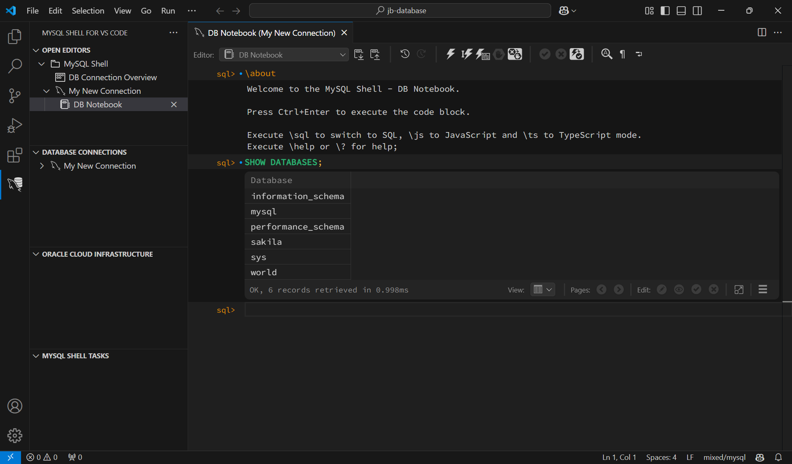

# Installing MySQL Shell for Visual Studio Code

1. Visual Studio Codeを開きます。
2. Extensionsを開きます。
3. **MySQL Shell**を検索し、Installをクリックします。

4. インストールが完了したら、アクティビティバーにあるMySQL Shelのアイコンをクリックします。

5. **Next**をクリックします。

6. **はい**をクリックします。

7. **Reload**をクリックします。

8. MySQL Shellがインストールされました。

## DB Connection

1. **New Connection**をクリックします。
2. **Caption**に「My New Connection」、**User Name**に「root」を入力します。

3. **Store Password**をクリックし、パスワードを入力します。
4. **OK**をクリックします。
5. **My First MySQL Connection**をクリックし、接続します。

6. 接続が成功したら、`SHOW DATABASES;`を入力し、実行します。実行するボタンが⚡️のマークです。

7. データベース一覧が表示されたら、接続成功です。

