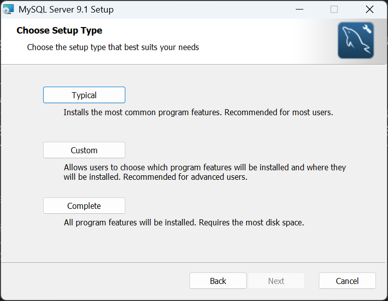
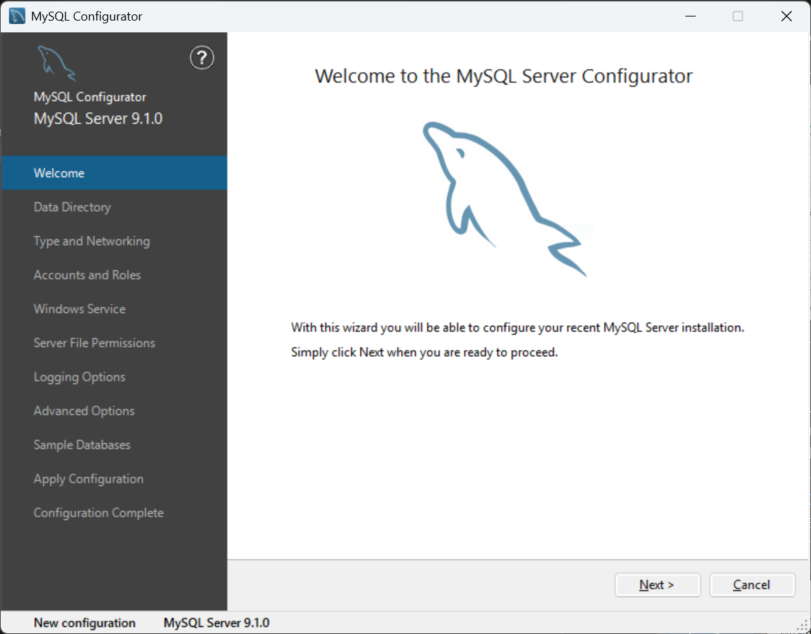
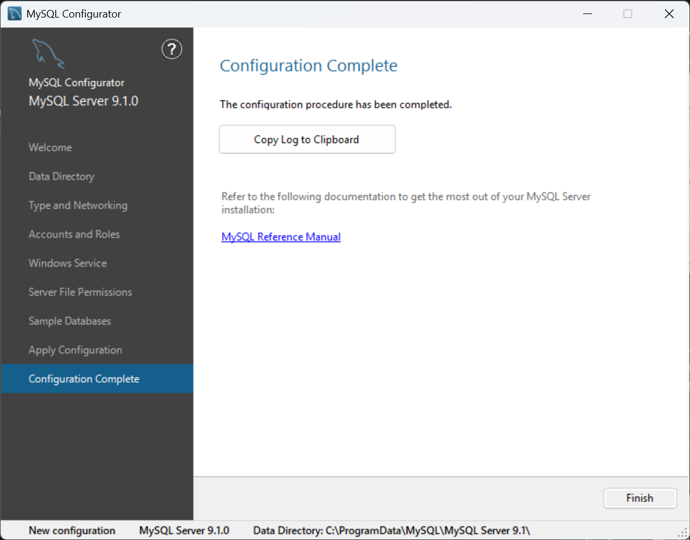
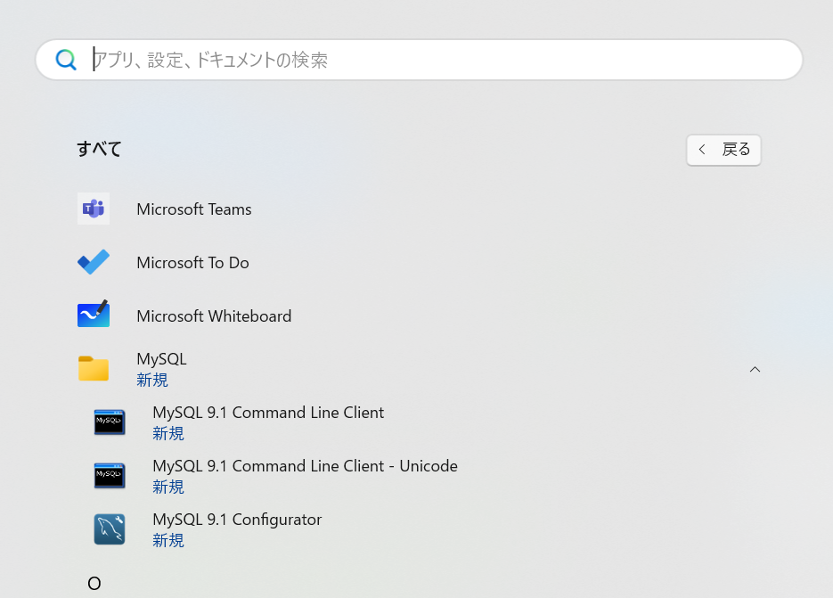
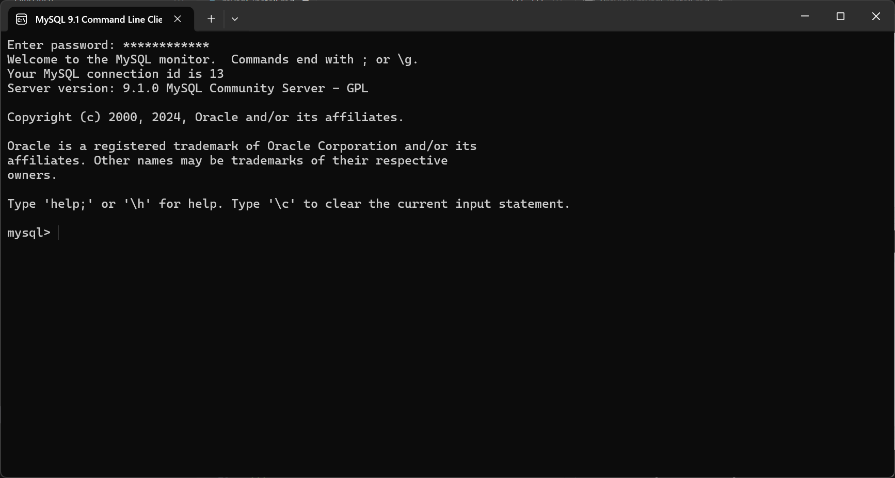

# MySQLのインストール

## Installing MySQL Server on Windows

ここでは、MySQL Community Serverのインストール方法を説明します。

1. MySQL Community Serverのインストーラをダウンロードするためには、公式サイトのダウンロードページ（[https://dev.mysql.com/downloads/mysql/](https://dev.mysql.com/downloads/mysql/)）にアクセスします。
2. 「Download」ボタンは複数ありますが、「Windows (x86, 64-bit), MSI Installer」をダウンロードします。

1. 「No thanks, just start my download.」を選択するとダウンロードが始まります。
2. ダウンロードした「mysql-9.1.0-winx64.msi」を実行すると、インストーラが起動します。もし「This application requires Visual Studio 2019 x64 Redistributable. Please install the Redistributable then run this installer again.」と表示された場合は、下記のNoteを参照してください。
3. セットアップの画面が表示されたら、Next*クリックします。

1. ライセンスが表示されたら、「I accept the terms in the License Agreement」にチェックを入れ、「Next」をクリックします。

1. セットアップの種類を選択します。ここでは、「Typical」を選択し、「Next」をクリックします。

1. 「Install」をクリックします。

1. 「Run MySQL Configurator」にチェックを入れている状態で、「Finish」をクリックします。


:::{note}
MySQL Community Serverをインストールするには、Microsoft Visual C++再頒布可能パッケージが必要です。
公式サイト（[https://learn.microsoft.com/ja-jp/cpp/windows/latest-supported-vc-redist?view=msvc-170](https://learn.microsoft.com/ja-jp/cpp/windows/latest-supported-vc-redist?view=msvc-170)）にアクセスし、「最新のMicrosoft Visual C++再頒布可能パッケージ」をダウンロードしてインストールしてください。「X64」、「x86」と「ARM64」の3つがありますが、CPUのアーキテクチャに合わせて適切なものを選択してください。
:::

以上でMySQL Community Serverのインストールが完了しましたが、続いてMySQL Configuratorの設定を行います。

## MySQL Configuratorの設定

1. MySQL Community Serverのインストールが完了したら、MySQL Configuratorが自動的に起動します。「Next」をクリックします。

1. 「Next」をクリックします。

1. ここでは「Type and Networking」を設定します。デフォルトのまま次へ進みます。

1. 「Accounts and Roles」の画面では、Rootアカウントのパスワードの設定を行います。「MySQL Root Password」と「Rpeat Password」に同じパスワードを入力し、「Next」をクリックします。

1. デフォルトのまま「Next」をクリックします。

1. 「Next」をクリックします。

1. 必要に応じて、Sample databasesを選択し、「Next」をクリックします。

1. 「Execute」をクリックします。

1. 実行が完了したら、「Next」をクリックします。

1. 「Finish」をクリックします。


以上でMySQL Community Serverのインストールが完了しました。

## MySQL Command Line Clientの起動

インストールが完了したら、スタートメニューから「MySQL 9.1 Command Line Client」を起動します。


クライアントが起動すると、パスワードの入力を求められますので、先ほど設定したMySQL Root Passwordを入力します。以下のように表示されたら、MySQL Serverに接続できています。



<!-- ## Mac

### Macに利用されているCPUアーキテクチャを確認する

1. Spotlightを開く（`Command + Space`を押す）
2. "ターミナル"と入力してEnterを押す
3. ターミナルで次のコマンドを実行する:

```bash
uname -m
```

- `arm64`が表示された場合、ARMアーキテクチャを利用しています。
- `x86_64`が表示された場合、Intelアーキテクチャを利用しています。

### MySQL Community Serverのインストール

1. [こちら](https://dev.mysql.com/downloads/)のページからMySQL Community Serverにアクセスします。
2. CPUアーキテクチャに合わせてDMGファイルをダウンロードします。
3. "No thanks, just start my download."をクリックします。
4. ダウンロードしたDMGファイルを実行し、インストールを開始します。
5. "Please enter the password for root user"と表示されたら、rootユーザの**パスワード**を入力します。

Step 5で入力したパスワードは、MySQLのrootユーザのパスワードです。このパスワードは忘れないようにしてください。

### MySQL Shellのインストール

1. [こちら](https://dev.mysql.com/downloads/)のページからMySQL Shellにアクセスします。
2. CPUアーキテクチャに合わせてDMGファイルをダウンロードします。
3. "No thanks, just start my download."をクリックします。
4. ダウンロードしたDMGファイルを実行し、インストールを開始します。 -->

<!-- 
### MySQL Community Serverのインストール

### MySQL Shellのインストール

## Visual Studio Codeのインストール

1. [こちら](https://code.visualstudio.com/)のページからVisual Studio Codeにアクセスします。
2. "Download for Mac"または"Download for Windows"をクリックします。
3. ダウンロードしたファイルを実行し、インストールを開始します。

## MySQL Shell for VS Codeのインストール

1. Visual Studio Codeを開きます。
2. Extensionsを開きます。
   - Mac: `Command + Shift + X`
   - Windows: `Ctrl + Shift + X`
3. "MySQL Shell for VS Code"を検索し、インストールします。
4. インストールが完了したら、"Next"をクリックし、インストールの認証を行います。
5. "Reload VS Code Window"をクリックし、Visual Studio Codeを再起動します。


