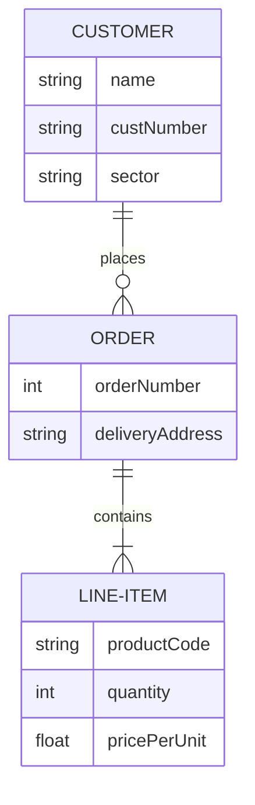
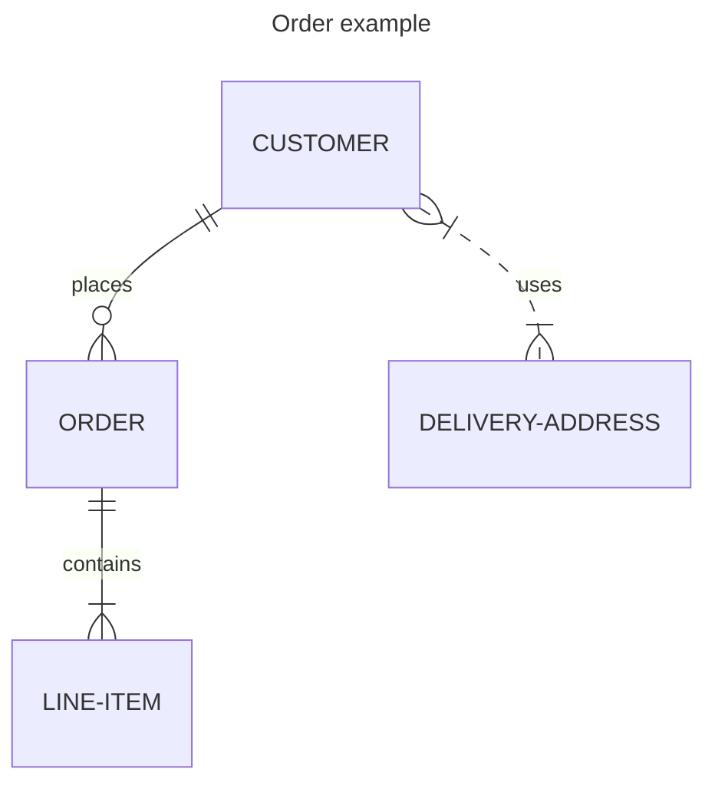

# 実体関連モデル

```{epigraph}
The purpose of abstracting is not to be vague, but to create a new semantic level in which one can be absolutely precise.

-- Edsger W. Dijkstra
```


<!-- :::{note}

チェンの論文では、英語

- P. P.-S. Chen, “English, Chinese and ER diagrams,” Data Knowl. Eng., vol. 23, no. 1, pp. 5–16, Jun. 1997.

英語の
(Correspondance between English sentences structure and ERD (Entity-Relationship Diagram) constructs.)

| 品詞     | ER構造     |
| :------- | :--------- |
| 一般名詞 | 実体型     |
| 固有名詞 | 実体       |
| 他動詞   | 関連型     |
| 自動詞   | 属性型     |
| 形容詞   | 実体の属性 |
| 副詞     | 関連の属性 |
::: -->

## データモデリング

データベースを構築するには、一般的に以下の三つのデータモデルを順番に設計する。

1. **概念モデル**（Conceptual Data Model）：ある記号系を用いて実世界の構造と意味を表現するモデル。
2. **論理モデル**（Logical Data Model）：概念モデルを実装可能な形式に変換したモデル。
3. **物理モデル**（Physical Data Model）：物理的な観点で記述されるデータモデル。

:::{note}
複数の段階に分けてデータモデルを設計する考え方は、**抽象化**（abstraction）という。抽象化はコンピュータ科学の基本的な考え方である。
:::

## 概念モデル

リレーショナルデータベースにおいて、概念モデリングのための記号系は**実体関連モデル**（Entity-Relationship Model, ERモデル）である。実体関連モデルは1976年にピーター・チェン（陳品山）によって提案された。実体関連モデルを図で表現したものを**実体関連図**（entity-relationship diagram, ER図）と呼ぶ。

リレーショナルデータモデルは論理モデルのための記号系であり、実体関連モデルはリレーショナルデータベーススキーマ（relational database schema）に変換される。

| RDB        | 記号系                     |
| :--------- | :------------------------- |
| 概念モデル | 実体関連モデル             |
| 論理モデル | リレーショナルデータモデル |


## 実体関連モデル

実体関連モデルは、実体、関連、属性の三つの要素から構成される。

### 実体と実体型

**実体**（entity）は、現実世界に存在する物体や事象を表す。**実体型**（entity type）は、実体集合（entity set）を表す。

例えば、「プログラミング」、「データベース」などの科目を実体とし、抽象化して「科目」という実体型を定義することができる。

### 関連と関連型

**関連**（relationship）は、実体間の関係を表す。**関連型**（relationship type）は、実体型間の抽象化された関係を表す。

例えば、「科目」と「教員」という二つの実体型があるとき、両者の関連を「担当」という関連型で表すことができる。

### 属性

実体型や関連型は、属性を持つことができる。**属性**（attribute）は、実体や関連の性質を表す。

例えば、「科目」という実体型には「科目ID」、「科目名」、「単位数」などの属性がある。


## 実体関連図

実体関連モデルを図で表現したものを**実体関連図**（entity-relationship diagram, ER図）と呼ぶ。

| ERモデル | ER図   |
| :------- | :----- |
| 実体型   | 四角形 |
| 関連型   | 菱形   |
| 属性     | 楕円形 |

<!-- https://dbnote.hontolab.org/content/er-model/01.html -->



